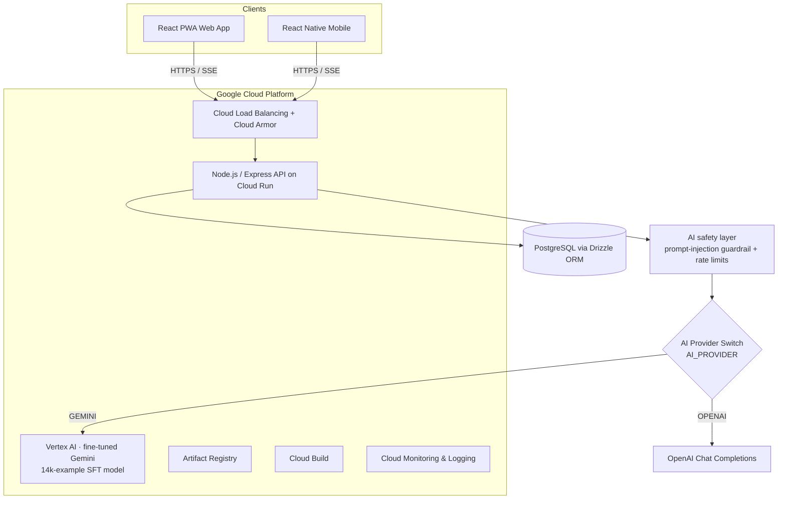

# Tunzafy | TunzAI — Code Showcase

> **Curated, read-only excerpt** of the Tunzafy production monorepo. The full codebase is
> a private pnpm monorepo; this repository surfaces the modules that best tell the story of
> how the product and its AI agent are built. Most files are intended to be *read*, not
> *built* — some import internal workspace packages (`@workspace/*`) that are not included
> here. **The exception is [`adk-agent/`](adk-agent/) — a fully standalone, runnable Google
> Agent Development Kit (ADK) agent** that judges can install and run in two commands.

---

## 🔗 Live product & demo videos

- **Live platform:** https://tunzafy.com
- **Founder's presentation** (problem, business case, Google Cloud + ADK): https://youtu.be/Fb3v07efaTg
- **Product demo (TunzAI in action):** https://youtu.be/1dUzNRDfJoA

---

## 🤖 The ADK agent (runnable) — start here

[`adk-agent/`](adk-agent/) is a standalone re-implementation of **TunzAI** on the
**Google Agent Development Kit (ADK for TypeScript, `@google/adk`)**. It is the part of
this repo built specifically for the **Google for Startups AI Agents Challenge**, and
unlike the rest of the showcase it **runs on its own** — no monorepo, no private packages.

It grounds its answers in Tunzafy's **live** job corpus by calling the same public
`/api/jobs/semantic-search` endpoint the website uses (Vertex AI Search over ~20k
fraud-gated jobs) — so it holds no database credentials, no secrets, and no private paths.

### ✨ Try it live (no install)

The agent is **deployed on Google Cloud Run** and answers over a public HTTP API —
no clone, no keys needed. It serves the ADK runtime directly (the same `rootAgent`
in this repo).

**Base URL:** `https://tunzai-agent-m2po7a42jq-uc.a.run.app`

```bash
BASE="https://tunzai-agent-m2po7a42jq-uc.a.run.app"

# 1) See the registered app
curl "$BASE/list-apps"            # -> ["agent"]

# 2) Open a session
curl -X POST "$BASE/apps/agent/users/judge/sessions/s1" \
  -H "Content-Type: application/json" -d '{}'

# 3) Ask the agent
curl -X POST "$BASE/run" -H "Content-Type: application/json" -d '{
  "appName": "agent", "userId": "judge", "sessionId": "s1",
  "newMessage": { "role": "user",
    "parts": [{ "text": "find me remote data analyst jobs in Kenya" }] }
}'
```

The response shows the full ADK trace: the root coordinator `transfer_to_agent` →
the `job_search_agent` calling `search_live_jobs` → a grounded answer with a real,
currently-open job from Tunzafy's live board.

### ADK core concepts demonstrated

| ADK concept | Where |
| --- | --- |
| `LlmAgent` (Gemini-backed declarative agents) | [`adk-agent/src/agent.ts`](adk-agent/src/agent.ts) |
| `FunctionTool` (typed, Zod-validated tools) | [`adk-agent/src/tools/`](adk-agent/src/tools) |
| **Multi-agent routing** via `subAgents` + built-in LLM transfer | [`adk-agent/src/agent.ts`](adk-agent/src/agent.ts) |
| **Agent callbacks** (before/after tool hooks) | [`adk-agent/src/callbacks.ts`](adk-agent/src/callbacks.ts) |
| **Plugins** (global runner lifecycle hooks) | [`adk-agent/src/plugins.ts`](adk-agent/src/plugins.ts) |
| **Security plugin + policy engine** (least-privilege tool authz) | [`adk-agent/src/security.ts`](adk-agent/src/security.ts) |
| **Memory** (`PreloadMemoryTool` + cross-session recall) | [`adk-agent/src/runMemory.ts`](adk-agent/src/runMemory.ts) |
| **Production memory** (Vertex AI Memory Bank — semantic RAG recall) | [`adk-agent/src/runMemoryVertex.ts`](adk-agent/src/runMemoryVertex.ts) |
| **Grounding** in real product data | [`adk-agent/src/tools/jobSearch.ts`](adk-agent/src/tools/jobSearch.ts) |
| **Evaluation** (trajectory + routing + response scoring) | [`adk-agent/src/eval.ts`](adk-agent/src/eval.ts) |

### How to run it locally

```bash
cd adk-agent
npm install
cp .env.example .env          # add a Gemini API key or Vertex AI project

npm run demo "find me remote data analyst jobs in Kenya"   # multi-agent + live grounding
npm run demo:memory           # cross-session memory recall (local prototype)
npm run demo:memory:vertex    # Vertex AI Memory Bank — semantic RAG recall
npm run eval                  # ADK-style trajectory/routing/response scoring
npm run agent:web             # ADK dev web UI — chat with the agent in a browser
```

Full details, architecture diagram, and the security model are in
[`adk-agent/README.md`](adk-agent/README.md).

---

## What is Tunzafy?

**Tunzafy** is a worldwide, AI-native career and recruitment platform. It pairs job
seekers with employers across **90+ countries** and **31 languages**, powered by a
proprietary conversational agent called **TunzAI**.

There are two faces of the same agent:

| Agent | Audience | What it does |
| --- | --- | --- |
| **TunzAI** | Job seekers | Conversational job discovery (jobs ≤ 10 days old), career-trajectory mapping, AI CV generation, auto-apply, multilingual advice. |
| **TunzAI Office** | Employers | Anonymous candidate discovery (Smart Anchor match score 0–150), bias-free job-description auditing, blind-hiring mode (EU AI Act aware), salary benchmarking, automated screening. |

Both run on the same model layer and the same provider abstraction shown in this repo.

---

## The AI provider story

TunzAI is moving onto **Google Cloud Vertex AI**, running a **Gemini model fine-tuned
(SFT) on a proprietary 14,000-example dataset** that encodes Tunzafy's exact persona,
tier rules, multilingual behavior, and safety guardrails.

Two things in this repo make that real:

1. **A runtime provider switch** ([`src/ai-provider/provider.ts`](src/ai-provider/provider.ts))
   that routes every chat completion to either OpenAI **or** Gemini/Vertex AI based on a
   single `AI_PROVIDER` env var — with **zero changes at any call site** and instant
   rollback. Both providers return the identical OpenAI-shaped `ChatCompletion`.

2. **The dataset generator** ([`tuning/generate_training_data.mjs`](tuning/generate_training_data.mjs))
   that produces the fine-tuning corpus across all intents, three tiers, and 31 languages,
   plus a small [native Gemini-format sample](tuning/sample_native_tuning.jsonl) showing the
   `systemInstruction` / `contents` / `parts` schema fed to Vertex AI tuning.

---

## Architecture (high level)



---

## What's in this showcase

```
tunzafy-showcase/
├── README.md                       ← you are here
├── adk-agent/                      ← ★ STANDALONE, RUNNABLE Google ADK agent
│   ├── README.md                   ← run instructions, architecture, security model
│   ├── src/
│   │   ├── agent.ts                ← root coordinator + 2 specialist sub-agents (LlmAgent)
│   │   ├── tools/                  ← FunctionTools: live job search, market data, CV templates
│   │   ├── callbacks.ts            ← ADK before/after tool callbacks (input hardening + grounding)
│   │   ├── plugins.ts              ← ADK Plugin: structured run/tool telemetry
│   │   ├── security.ts             ← deny-by-default tool policy engine (ADK SecurityPlugin)
│   │   ├── runMemory.ts            ← cross-session memory recall demo
│   │   └── eval.ts                 ← trajectory + routing + response eval harness
│   └── eval/tunzai.evalset.json    ← evaluation cases
├── src/
│   ├── ai-provider/
│   │   ├── provider.ts             ← ★ OpenAI ↔ Gemini/Vertex AI runtime switch (factory)
│   │   ├── client.ts               ← OpenAI client + additive Vertex failover layer
│   │   └── index.ts                ← public exports of the AI integration package
│   ├── api-agent/
│   │   └── ai-route.excerpt.ts     ← excerpt of the live agent route (SSE streaming, guardrails)
│   └── safety/
│       └── aiSafety.ts             ← prompt-injection sanitizer + per-user rate limiting
├── config/
│   └── env.example                 ← environment template (placeholders only — no secrets)
└── tuning/
    ├── generate_training_data.mjs  ← deterministic fine-tuning dataset generator
    └── sample_native_tuning.jsonl  ← 12-line sample of the native Gemini SFT format
```

### Highlight: the provider switch

The core of the provider abstraction is a strategy/factory pattern. Calling code keeps
using a single `aiChat(...)` function; the destination is decided at runtime:

```ts
// AI_PROVIDER = "OPENAI" (default) | "GEMINI"
export function getActiveProvider(): AIProvider {
  return process.env.AI_PROVIDER?.trim().toUpperCase() === "GEMINI"
    ? "GEMINI"
    : "OPENAI";
}
```

The Gemini branch lazily loads `@google-cloud/vertexai`, maps OpenAI `messages` →
Vertex `contents` + `systemInstruction`, and normalizes the Vertex response back into the
OpenAI `ChatCompletion` shape — so existing parsing, error handling, and SSE streaming all
keep working unchanged.

---

## Technology

- **Language:** TypeScript end-to-end (Node.js / Express API, React PWA web, React Native mobile)
- **AI:** Google **Vertex AI** + **fine-tuned Gemini**; OpenAI as the fallback provider; `@google-cloud/vertexai` SDK
- **Agents:** **Google Agent Development Kit (ADK for TypeScript, `@google/adk`)** — multi-agent routing, callbacks, plugins, memory, and evaluation (see [`adk-agent/`](adk-agent/))
- **Data:** PostgreSQL with **Drizzle ORM**; Zod contracts shared across client/server
- **Infra (Google Cloud):** Cloud Run, Cloud Build, Artifact Registry, Cloud Load Balancing + Cloud Armor, Cloud Monitoring & Logging
- **Delivery:** pnpm monorepo, SSE streaming for the "typing" agent experience

---

## Languages


Tunzafy is a **TypeScript-first** codebase. The approximate language composition of the
production monorepo:

| Language | Share | Where it's used |
| --- | ---: | --- |
| **TypeScript** | ~85% | API (Node.js / Express), React PWA web, React Native mobile, shared Zod contracts |
| **SQL / PostgreSQL** | ~7% | Drizzle ORM schema & migrations |
| **JavaScript** | ~5% | Build tooling and the fine-tuning dataset generator |
| **JSON / YAML** | ~2% | Config, Cloud Run / Cloud Build manifests, locale data |
| **Shell** | ~1% | Deploy and maintenance scripts |

```text
TypeScript      ████████████████████████████████████░░░░  ~85%
SQL/PostgreSQL  ███░░░░░░░░░░░░░░░░░░░░░░░░░░░░░░░░░░░░░░░   ~7%
JavaScript      ██░░░░░░░░░░░░░░░░░░░░░░░░░░░░░░░░░░░░░░░░   ~5%
JSON/YAML       █░░░░░░░░░░░░░░░░░░░░░░░░░░░░░░░░░░░░░░░░░   ~2%
Shell           ░░░░░░░░░░░░░░░░░░░░░░░░░░░░░░░░░░░░░░░░░░   ~1%
```

> Percentages are approximate and describe the full production monorepo. This showcase
> repo intentionally surfaces only a small TypeScript excerpt, so GitHub's own language
> bar reflects just the files included here.

---

## Security & privacy notes

- This repository contains **no secrets**. The only configuration file is a template
  ([`config/env.example`](config/env.example)) with placeholder values; all real keys live in
  Google Secret Manager and are injected into Cloud Run at deploy time.
- Candidate discovery is **anonymous by design**: names, photos, and ages are withheld
  until an employer explicitly unlocks a profile, and blind-hiring mode supports EU AI Act
  compliance.
- The agent input pipeline strips zero-width / bidi-override characters, caps input length,
  appends a prompt-injection guardrail, and rate-limits per user — see
  [`src/safety/aiSafety.ts`](src/safety/aiSafety.ts).
- The ADK agent is hardened independently: a **deny-by-default tool policy engine**
  ([`adk-agent/src/security.ts`](adk-agent/src/security.ts)) wired into ADK's `SecurityPlugin`,
  an **SSRF host allow-list** for all outbound calls, and tool-argument clamping. It reaches
  Tunzafy only through the public read-only search endpoint — no database, no secrets.

---

## Author

Built by **Samuel Hatangimana**, founder of Tunzafy (Estonia).
