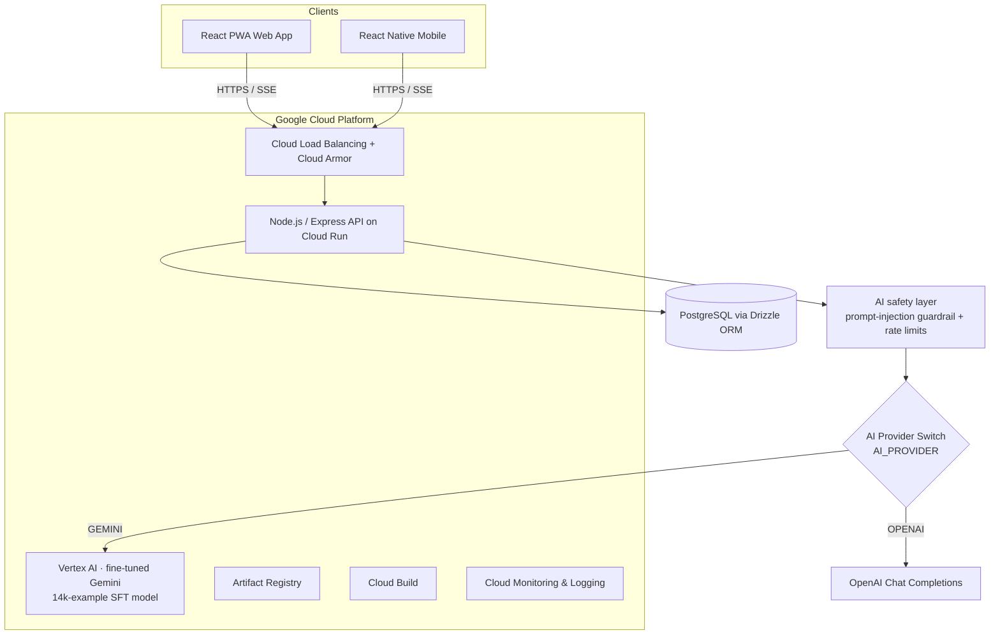

# Tunzafy | TunzAI — Code Showcase

> **Curated, read-only excerpt** of the Tunzafy production monorepo, prepared for the
> **Google for Startups AI Agents Challenge** judges. The full codebase is a private
> pnpm monorepo; this repository surfaces the modules that best tell the story of how
> the product and its AI agent are built. It is intended to be *read*, not *built* —
> some files import internal workspace packages (`@workspace/*`) that are not included here.

---

## What is Tunzafy?

**Tunzafy** is a worldwide, AI-native career and recruitment platform. It pairs job
seekers with employers across **90+ countries** and **31 languages**, powered by a
proprietary conversational agent called **TunzAI**.

There are two faces of the same agent:

| Agent | Audience | What it does |
| --- | --- | --- |
| **TunzAI** | Job seekers | Conversational job discovery (jobs ≤ 10 days old), career-trajectory mapping, AI CV generation, auto-apply, multilingual advice. |
| **TunzAI Office** | Employers | Anonymous candidate discovery (Smart Anchor match score 0–150), bias-free job-description auditing, blind-hiring mode (EU AI Act aware), salary benchmarking, automated screening. |

Both run on the same model layer and the same provider abstraction shown in this repo.

---

## The Google Cloud / Gemini story

TunzAI is moving onto **Google Cloud Vertex AI**, running a **Gemini model fine-tuned
(SFT) on a proprietary 14,000-example dataset** that encodes Tunzafy's exact persona,
tier rules, multilingual behavior, and safety guardrails.

Two things in this repo make that real:

1. **A runtime provider switch** ([`src/ai-provider/provider.ts`](src/ai-provider/provider.ts))
   that routes every chat completion to either OpenAI **or** Gemini/Vertex AI based on a
   single `AI_PROVIDER` env var — with **zero changes at any call site** and instant
   rollback. Both providers return the identical OpenAI-shaped `ChatCompletion`.

2. **The dataset generator** ([`tuning/generate_training_data.mjs`](tuning/generate_training_data.mjs))
   that produces the fine-tuning corpus across all intents, three tiers, and 31 languages,
   plus a small [native Gemini-format sample](tuning/sample_native_tuning.jsonl) showing the
   `systemInstruction` / `contents` / `parts` schema fed to Vertex AI tuning.

---

## Architecture (high level)



---

## What's in this showcase

```
tunzafy-showcase/
├── README.md                       ← you are here
├── src/
│   ├── ai-provider/
│   │   ├── provider.ts             ← ★ OpenAI ↔ Gemini/Vertex AI runtime switch (factory)
│   │   ├── client.ts               ← OpenAI client + additive Vertex failover layer
│   │   └── index.ts                ← public exports of the AI integration package
│   ├── api-agent/
│   │   └── ai-route.excerpt.ts     ← excerpt of the live agent route (SSE streaming, guardrails)
│   └── safety/
│       └── aiSafety.ts             ← prompt-injection sanitizer + per-user rate limiting
├── config/
│   └── env.example                 ← environment template (placeholders only — no secrets)
└── tuning/
    ├── generate_training_data.mjs  ← deterministic fine-tuning dataset generator
    └── sample_native_tuning.jsonl  ← 12-line sample of the native Gemini SFT format
```

### Highlight: the provider switch

The core of the Google Cloud migration is a strategy/factory pattern. Calling code keeps
using a single `aiChat(...)` function; the destination is decided at runtime:

```ts
// AI_PROVIDER = "OPENAI" (default) | "GEMINI"
export function getActiveProvider(): AIProvider {
  return process.env.AI_PROVIDER?.trim().toUpperCase() === "GEMINI"
    ? "GEMINI"
    : "OPENAI";
}
```

The Gemini branch lazily loads `@google-cloud/vertexai`, maps OpenAI `messages` →
Vertex `contents` + `systemInstruction`, and normalizes the Vertex response back into the
OpenAI `ChatCompletion` shape — so existing parsing, error handling, and SSE streaming all
keep working unchanged.

---

## Technology

- **Language:** TypeScript end-to-end (Node.js / Express API, React PWA web, React Native mobile)
- **AI:** Google **Vertex AI** + **fine-tuned Gemini**; OpenAI as the fallback provider; `@google-cloud/vertexai` SDK
- **Data:** PostgreSQL with **Drizzle ORM**; Zod contracts shared across client/server
- **Infra (Google Cloud):** Cloud Run, Cloud Build, Artifact Registry, Cloud Load Balancing + Cloud Armor, Cloud Monitoring & Logging
- **Delivery:** pnpm monorepo, SSE streaming for the "typing" agent experience

---

## Languages


Tunzafy is a **TypeScript-first** codebase. The approximate language composition of the
production monorepo:

| Language | Share | Where it's used |
| --- | ---: | --- |
| **TypeScript** | ~85% | API (Node.js / Express), React PWA web, React Native mobile, shared Zod contracts |
| **SQL / PostgreSQL** | ~7% | Drizzle ORM schema & migrations |
| **JavaScript** | ~5% | Build tooling and the fine-tuning dataset generator |
| **JSON / YAML** | ~2% | Config, Cloud Run / Cloud Build manifests, locale data |
| **Shell** | ~1% | Deploy and maintenance scripts |

```text
TypeScript      ████████████████████████████████████░░░░  ~85%
SQL/PostgreSQL  ███░░░░░░░░░░░░░░░░░░░░░░░░░░░░░░░░░░░░░░░   ~7%
JavaScript      ██░░░░░░░░░░░░░░░░░░░░░░░░░░░░░░░░░░░░░░░░   ~5%
JSON/YAML       █░░░░░░░░░░░░░░░░░░░░░░░░░░░░░░░░░░░░░░░░░   ~2%
Shell           ░░░░░░░░░░░░░░░░░░░░░░░░░░░░░░░░░░░░░░░░░░   ~1%
```

> Percentages are approximate and describe the full production monorepo. This showcase
> repo intentionally surfaces only a small TypeScript excerpt, so GitHub's own language
> bar reflects just the files included here.

---

## Security & privacy notes for reviewers

- This repository contains **no secrets**. The only configuration file is a template
  ([`config/env.example`](config/env.example)) with placeholder values; all real keys live in
  Google Secret Manager and are injected into Cloud Run at deploy time.
- Candidate discovery is **anonymous by design**: names, photos, and ages are withheld
  until an employer explicitly unlocks a profile, and blind-hiring mode supports EU AI Act
  compliance.
- The agent input pipeline strips zero-width / bidi-override characters, caps input length,
  appends a prompt-injection guardrail, and rate-limits per user — see
  [`src/safety/aiSafety.ts`](src/safety/aiSafety.ts).

---

## Author

Built by **Samuel Hatangimana**, founder of Tunzafy (Estonia).
